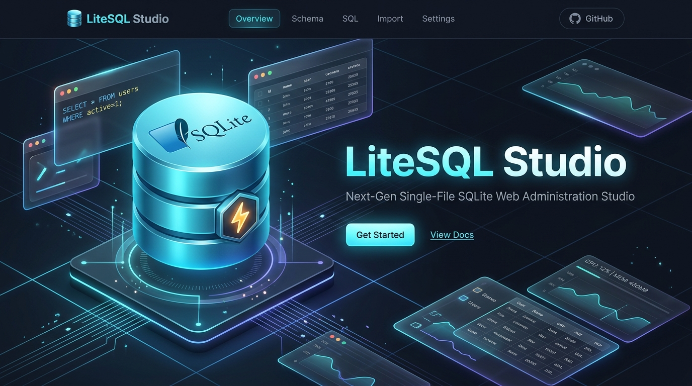
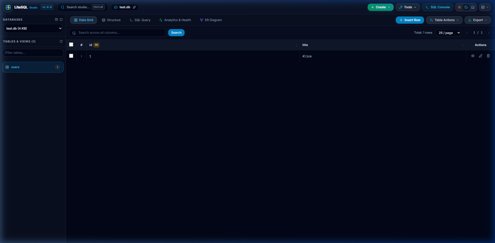
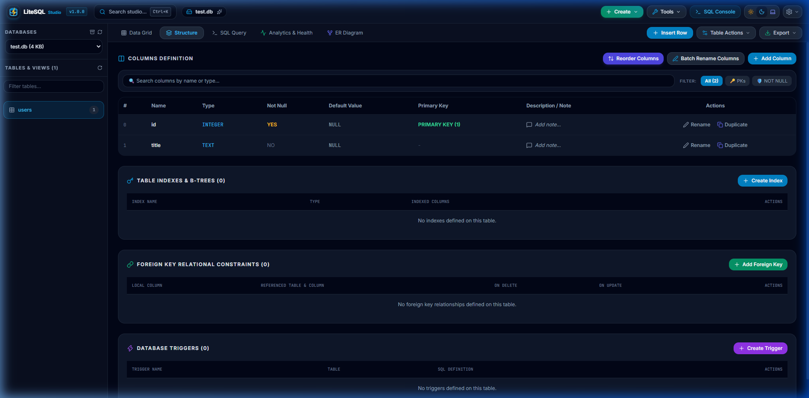
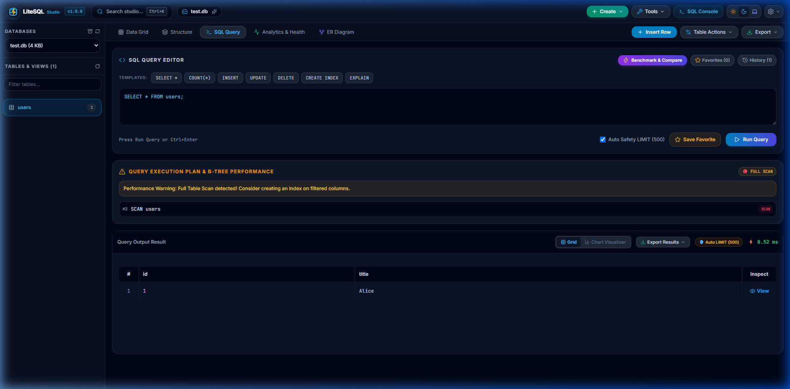
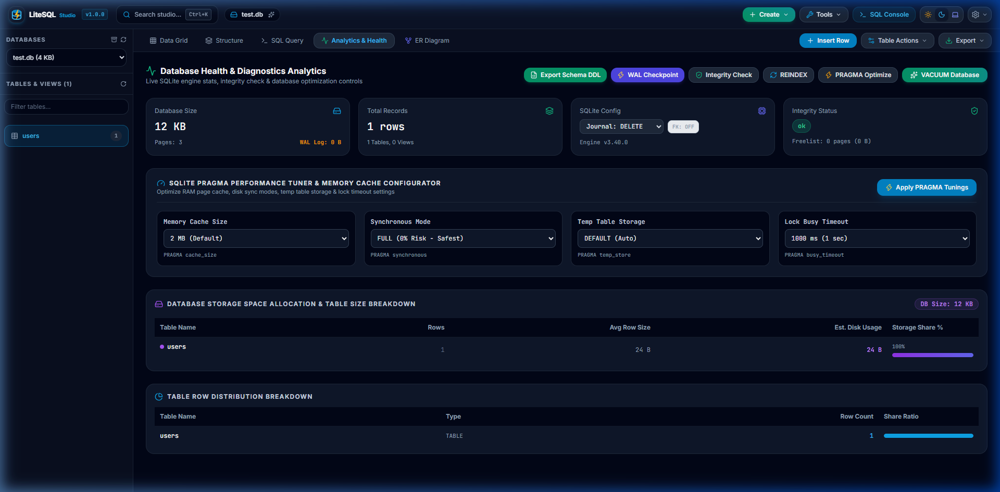

# ⚡ LiteSQL Studio

<div align="center">



### **Next-Generation, Single-File SQLite Web Administration Studio**

[](https://php.net)
[](https://sqlite.org)
[](./litesql.php)
[](./LICENSE)
[](https://tailwindcss.com)

[**Live Features**](#-key-features) • [**Quick Start**](#-quick-start) • [**Security Guide**](#-production-security--hardening-guide) • [**Documentation**](#-full-feature-breakdown)

---

</div>

## 🖼️ Screenshots & Studio Gallery

### 📊 1. Data Grid & Inline Record Editor


### 🧱 2. Table Structure, Column Reorder & Notes Manager


### ⚡ 3. SQL Console & B-Tree Query Plan Inspector


### 📈 4. Database Analytics, Storage & Health Dashboard


---

## 🌟 Why LiteSQL Studio?

Outdated tools like **phpLiteAdmin** and **Adminer** were built over a decade ago. They suffer from full page reloads, 2000s-era interface design, lack of dark mode, and zero modern SQL intelligence features.

**LiteSQL Studio** is engineered as the ultimate modern alternative for 2026:
- 🚀 **100% Single-File Drop-in**: Zero external PHP dependencies or npm installation required. Just drop `litesql.php` onto any PHP 8.2+ server.
- 🎨 **Modern Glassmorphism UI**: Native Day ☀️ / Dark 🌙 / System 💻 theme switching powered by Tailwind CSS & Alpine.js.
- ⚡ **Excel-Style AJAX Data Grid**: Double-click any cell to edit data inline instantly without page reloads.
- 🧠 **Live SQL Autocomplete & IntelliSense**: Full keyword, table, and column suggestions in the integrated SQL console.
- 🛡️ **Auto-Safety Safeguards**: Automatic `LIMIT 500` queries protect server memory from crashing browser tabs on massive tables.

---

## ⚡ Key Features

### 📊 1. Data Grid & Record CRUD
- **Excel-Style Inline Editing**: Double-click any cell to edit and save values via AJAX.
- **Bulk Record Management**: Select multiple rows to perform batch deletion or multi-row record updates.
- **Record Inspector (👁️)**: Inspect individual records in a clean vertical breakdown modal with 1-click `📋 Copy JSON`.
- **Interactive Header Sorting**: Click table column headers to cycle between `ASC`, `DESC`, and reset states with glowing visual sorting badges.

### 🧱 2. Table Structure & Schema Management
- **Full Batch Schema Definition Editor**: Edit all column names, data types, default values, and NOT NULL constraints simultaneously while preserving 100% of existing table row data.
- **↕️ Column Quick Reorder Wizard**: Move column positions up (`▲`) or down (`▼`) using atomic transaction-wrapped table rebuilding.
- **📋 Column Quick Duplicate & Cloning Tool**: Clone existing table columns along with optional row data copying.
- **📝 Column Description & Notes Manager**: Attach custom documentation notes to table columns, stored locally per database file.
- **🔍 Column Search & Schema Filter**: Instantly search columns by keyword or filter by Primary Keys (🔑) and NOT NULL (🛡️) attributes.

### ⚡ 3. SQL Console & Performance Profiler
- **Live SQL Autocomplete & IntelliSense**: Context-aware dropdown autocomplete for SQL keywords, table names, and column identifiers.
- **📊 Real-Time Column Summary Aggregations**: Auto-calculate `SUM`, `AVG`, `MIN`, `MAX`, and sample `COUNT` metrics for numeric columns in SQL query result sets.
- **✨ 1-Click SQL Formatter & Beautifier**: Instantly clean, indent, and format messy single-line SQL queries into clean multi-line structured code.
- **🧪 SQL Dry Run Lock (Transaction Sandbox Mode)**: Test dangerous `UPDATE`, `DELETE`, `DROP`, or `INSERT` queries inside an isolated transaction that automatically `ROLLBACK`s — inspecting affected rows with 0% write effect on database disk.
- **📑 SQL Output Grid Pagination**: Seamless `◀ Prev` / `Next ▶` page navigation, customizable page sizes (`25`, `50`, `100`, `250`), and live record range indicators (`Showing 1 to 50 of 1521 fetched rows`).
- **📶 Interactive Result Column Header Sorting**: Click any result grid column header to cycle through `ASC`, `DESC`, and reset states with glowing visual sort badges.
- **🛡️ Configurable Safety Limit Selector**: Select safety query caps (`500`, `1,000`, `2,500`, `5,000` rows) protecting server memory while analyzing large datasets.
- **EXPLAIN QUERY PLAN Inspector**: Automated B-tree execution profiling displaying full table scan warnings (🔴 `FULL SCAN`) and index optimization suggestions.
- **⭐ Saved Queries & History Drawer**: Bookmark frequently used SQL statements with category tags (`Reports`, `Users`, `Cleanup`) and search through executed query logs.
- **⚡ Dual SQL Performance Benchmarker**: Run side-by-side speed tests comparing Query A vs Query B across configurable iteration counts.

### 📈 4. Database Analytics, Storage & Health
- **Database Storage Space Breakdown**: Visual progress bars displaying estimated storage allocation and average row sizes per table.
- **⚡ PRAGMA Performance Tuner**: 1-click configuration for `PRAGMA cache_size` (2MB–64MB), `synchronous` (FULL/NORMAL/OFF), `temp_store` (MEMORY/FILE), and `busy_timeout`.
- **1-Click Maintenance Suite**: Run `PRAGMA integrity_check`, `VACUUM`, `REINDEX`, and `PRAGMA optimize` with live toast feedback.
- **⚡ WAL Checkpoint & Mode Controls**: Monitor `.sqlite-wal` file sizes in real time and execute WAL log frame truncation checkpoints.

### 🌿 5. Visualization & Schema Tools
- **Interactive ER Diagram Exporter**: View database tables and foreign key relationships, copy Mermaid.js ER markup, or export high-resolution vector `.svg` diagrams.
- **📄 Schema DDL SQL Exporter**: Generate complete `.sql` migration DDL scripts for tables, indexes, triggers, and views with optional `DROP TABLE IF EXISTS` statements.
- **🎲 Smart Mock Data Generator**: Populate test tables with realistic names, emails, phone numbers, locations, statuses, prices, and timestamps.
- **📦 Multi-Database ZIP Backup Exporter**: Automatically detect and download all server `.sqlite` databases bundled into a single compressed ZIP archive.
- **⇄ Dual Database Diff & Schema Comparator**: Compare two server database files side-by-side to highlight missing tables, column mismatches, and row variances.

---

## 🚀 Quick Start

### 1. Requirements
- **PHP**: 8.2 or higher
- **Extensions**: `pdo_sqlite` enabled

### 2. Installation (1-Click Upload)
Simply download [`litesql.php`](./litesql.php) and place it in your web server directory (e.g. Apache, Nginx, or LiteSpeed):

```bash
# Option A: Run locally using PHP Built-in Web Server
php -S localhost:8000
```

Open your browser and navigate to:
```
http://localhost:8000/litesql.php
```

### 3. Default Login Password
- **Default Password**: `admin`

### 💡 Framework Integration Guide (Laravel, Symfony, WordPress)
If your SQLite database file is located outside the web server's public root folder (e.g. Laravel's `database/database.sqlite`), keep your database 100% safe from direct browser downloads by dropping `litesql.php` into your `public/` directory and updating **Line 19** of `litesql.php`:

```php
// Line 19 in litesql.php - Safely scan parent directory outside public/
$scanDirectory = dirname(__DIR__); // Scans parent directory & database/ folder
```

---

## 🔒 Production Security & Hardening Guide

Because LiteSQL Studio grants full administrative access to your SQLite databases, securing the installation on production servers is critical.

### 1. 🔑 Change Default Master Password (Mandatory)
1. Log into LiteSQL Studio.
2. Click **`🔒 Security`** in the top navigation header.
3. Enter the current password (`admin`) and set a strong, unique new password.
4. Click **`Save Password`**.
*The new password is automatically hashed using native PHP `password_hash()` (BCrypt) and stored in `.litesql_config.json`.*

### 2. ⚠️ Delete `litesql.php` After Server Maintenance (Best Practice)
If you are using LiteSQL Studio for temporary database inspection or server migration on a live production server:
> **Golden Security Rule**: **Delete `litesql.php` from your web server immediately after finishing your maintenance task!**  
> Since LiteSQL Studio is contained in a single drop-in file, you can upload it again whenever you need to perform future administrative tasks.

### 3. 🛡️ Restrict Access by IP Address via `.htaccess` (Apache)
If keeping `litesql.php` on a web server long-term, restrict access exclusively to your trusted IP address:

```apache
# Add this inside your .htaccess file
<Files "litesql.php">
    Order Deny,Allow
    Deny from all
    Allow from 123.45.67.89  # Replace with your actual IP address
</Files>
```

### 4. 🔑 Protect File Permissions
Ensure directory and file permissions prevent unauthorized web users from modifying backend files:
```bash
chmod 600 litesql.php
chmod 600 .litesql_config.json
```

### 5. 🔐 Enforce HTTPS / SSL Encryption
Never access your SQLite administration panel over plain HTTP. Always serve your web application over HTTPS with an active SSL certificate (e.g. Let's Encrypt) to prevent credential sniffing on public networks.

---

## 🌐 SEO & Search Keywords

`sqlite web manager`, `single file sqlite admin`, `php sqlite gui`, `litesql studio`, `phpliteadmin alternative`, `adminer sqlite replacement`, `lightweight sqlite dashboard`, `standalone php sqlite manager`, `browser sqlite editor`, `sqlite database administration`.

---

## 👤 Author & Creator

Created and maintained with ❤️ by **Dhiraj Sharma**:
- 🌐 **Website**: [https://dhirajsharma.com](https://dhirajsharma.com)
- 📧 **Email**: [dheeraj.gzp@gmail.com](mailto:dheeraj.gzp@gmail.com)
- 📞 **Mobile / WhatsApp**: [+91 9795164872](tel:+919795164872)
- 🐙 **GitHub**: [@litesql-studio](https://github.com/litesql-studio)

---

## 💖 Support & Sponsor Project

If you find **LiteSQL Studio** helpful for your work, consider supporting its continuous open-source development!

[](https://buymeacoffee.com/dhirajsharma)
[](https://github.com/sponsors/litesql-studio)

- ☕ **Buy Me a Coffee**: [buymeacoffee.com/dhirajsharma](https://buymeacoffee.com/dhirajsharma)
- 📱 **UPI / GPay / PhonePe**: `9795164872@ybl` (Dhiraj Sharma)
- 🌐 **Direct Donation**: [dhirajsharma.com/donate](https://dhirajsharma.com/donate)

---

## 📄 License

This project is licensed under the [MIT License](./LICENSE). Free for personal, open-source, and commercial use.

---

<div align="center">

**Built with ❤️ by Dhiraj Sharma for the Global Open Source Developer Community**

</div>
